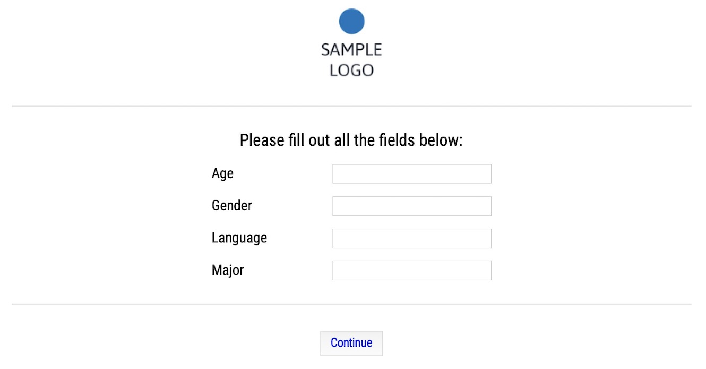

[](https://github.com/psf/black)

# PyExp &mdash; Linguistic Experiments using tkinter and Python 3

This is one of my ongoing side projects: an experiment script with Python 3 using tkinter. The scope of this effort is fairly limited for now:

* have a fairly straight-forward structure with which to carry out linguistic experiments offline (in a lab setting with multiple computers, for example)
  * to achieve this, I made the choice to limit aesthetic flexibility in favor of a broad(-ish) coverage of important paradigms and minimal specification effort before the experiment is ready to go
* include these paradigms (for now):
  * linguistic judgments (Likert-style) of text and audio stimuli &mdash; the latter of which can either be present locally or streamed from online sources
  * recording of reaction times (done automatically for all experiment types)
  * forced choice (either dynamic or static) between images or text options
  * self-paced-reading (either cumulative or static)
* ability to choose between the various paradigms and to specify the way the experiment is to be run (e.g., with or without a training portion) and what kind of data is to be collected (e.g., different meta-data fields)

## What It Looks Like



## Getting Started

To run the experiment, simply adjust the settings in `config.yaml` (or any other yaml file of your choosing with the relevant settings) and add your item files to the mix before running `experiment.py`. The experiment should then run as specified (barring any code blunders on my part). Alternatively, if you just want to have a look at the way everything works and looks, you can simply run it as-is; a wide variety of exemplary item lists and items is provided (and used for testing purposes).

```python
my_exp = Experiment("config.yaml")
my_exp.start_experiment()
```

**ADD**:

* an explanation of the various settings available in `config.yaml`

## Details

In order to display the experiment, tkinter is used (unfortunately, so far, I have only tested this script on Mac OS, but I do hope that this should not be a problem), internal data handling and exporting is accomplished with pandas, while anything relating to audio files relies on pygame.

Here are the first few lines of the results for a Forced Choice experiment, where the `finished`-column indicates whether the entire set of items was completed or not:

| id              | date       | start_time | tester | age | gender | language | major | sub_exp | item | cond | judgment | reaction_time | finished | feedback | duration |
| --------------- | ---------- | ---------- | ------ | --- | ------ | -------- | ----- | ------- | ---- | ---- | -------- | ------------- | -------- | -------- | -------- |
| uuvvomdbmam9fzc | 04/03/2020 | 11:46:54   | TEST   | 99  | n/a    | python   | none  | 1       | 1    | a    | opt1     | 1.48082       | F        | cool exp | 10.2     |
| uuvvomdbmam9fzc | 04/03/2020 | 11:46:54   | TEST   | 99  | n/a    | python   | none  | 1       | 3    | b    | reject   | 0.9502        | F        | cool exp | 10.2     |
| uuvvomdbmam9fzc | 04/03/2020 | 11:46:54   | TEST   | 99  | n/a    | python   | none  | 1       | 2    | a    | opt2     | 0.88746       | F        | cool exp | 10.2     |
| uuvvomdbmam9fzc | 04/03/2020 | 11:46:54   | TEST   | 99  | n/a    | python   | none  | 1       | 4    | b    | opt1     | 1.14362       | F        | cool exp | 10.2     |

As you can see, the results file is fairly dense and errs on the side of including too much information. I find this makes things easier in case unexpected circumstances occur or testing is done under non-ideal conditions (long stretch of time to test all participants; lots of different experimenters doing the testing, what have you).

## Desiderata

Below is a list of features I would like to implement in the future. While it is no guarantee that this will actually happen, the following list is supposed to hold me (somewhat) accountable.

* support for video stimuli
* option to have several experimental blocks with a break in between

## Feedback

If you have any comments, feature requests or suggestions, please feel free to send me an [e-mail](mailto:maik.thalmann@gmail.com?subject=[GitHub]%20PyExp).

## Acknowledgments

Thank you to anybody whose code I used and likely butchered in my own implementation!
